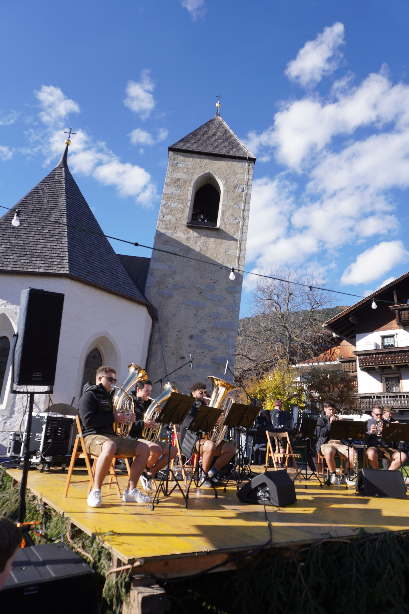

**Absolvent:innenverein HAK/HAS-Wörgl: Herbstfahrt mit Törggelen**

## Tag 1 – Samstag 08. November 2025

Eine Truppe von 31 gut gelaunten HAK/HAS-Veteranen inklusive Anhang startete frühmorgens bei trübem Wetter von Kufstein in Richtung Süden. Die Vorfreude war groß, die traditionelle Kühltasche und die Süßigkeitenkörbchen gut gefüllt. Zur Einstimmung wurde schon mit einem guten Tropfen aus eigens dafür angeschafften Reise-Weingläsern (aus Glas!) auf das bevorstehende Törggelen angestoßen.

<!--more-->

Am frühen Vormittag brachte uns unser Chauffeur Patrick nach einer reibungslosen flotten Fahrt über den Brenner ganz frech quasi bis vor die Haustüre des Ötzi-Museums in Bozen. Dort gab es eine spannende Führung in zwei Gruppen, die uns den Ötzi näherbrachte – waren wir doch bei seiner Entdeckung damals am 19.9.1991 ja alle fast schon live dabei! Die im Hintergrund laufenden Ausschnitte aus Tirol Heute weckten so manche Erinnerung und das Rätsel um Ötzis Todesumstände führte teils zu intensiven Diskussionen, ein wahres "CSI Ötzi" sozusagen.

Danach gab es ausgiebig Zeit für einen Stadtbummel sowie eine kleine Stärkung und natürlich um das südliche Flair zu genießen und sich in den Sonnenstrahlen aufzuwärmen. In kleinen Grüppchen trabte die gesamte Reisegesellschaft kreuz und quer durchs Stadtzentrum mit seinen abwechslungsreichen Lauben rund um den sonnigen Waltherplatz und immer wieder traf man bekannte Gesichter. Im Zuge einer solchen Begegnung wurde auch die ehrenvolle Aufgabe, einen Reisebericht zu verfassen, kurz und schmerzlos an die Neulinge in der Runde übergeben – also viel Spaß beim Bericht aus unserer Sicht 😊

Am Nachmittag ging es dann mit dem Bus die lange kurvenreiche Straße auf den Ritten. Bis hinauf nach Lengmoos wurde dem einen oder anderen etwas flau im Magen, aber die wunderbare Aussicht auf die herbstliche Umgebung und das Bergpanorama mit dem Rosengarten und dem Schlern inklusive Sonnenuntergang war Entschädigung genug. Anschließend folgte ein kurzer Spaziergang zu einem einzigartigen Naturschauspiel – den faszinierenden Erdpyramiden. Ein kleiner Spazierweg am Waldrand führte uns immer näher und wir konnten den herrlichen Ausblick genießen. Es wurde dabei schon recht frisch und da freuten wir uns auch wohl alle wieder auf den warmen Bus. Dort gab es wieder für einige ein Schlückerl für den Weg, nicht dass noch jemand austrocknet 😉

Nach einer gemütlichen Fahrt herunter vom Ritten und dann Richtung Norden erreichten wir unser Quartier beim Brunnerhof in Klausen, der gut auf unseren Ansturm vorbereitet war. Jeder huschte für eine kleine Pause aufs gemütliche Zimmer und schon bald gab es wieder ein Treffen an der Bar auf einen Aperitif. Dabei wurde nicht zu knapp in Erinnerungen geschwelgt, bis es Zeit zum Essen war. In den üblichen Grüppchen verteilten sich alle im Speisesaal, genossen das Vorspeisenbuffet und plauderten bei einem guten Menü über Neues und die alten Zeiten. Einige zog es schon recht bald ins warme Bett, andere hielten bei dem einen oder anderen Glasl schon länger aus. Wir Frischlinge präsentierten uns dabei von unserer besten Seite und gehörten zum Teil zum ganz harten Kern, der zum Abschluss traditionell wieder die Bar im Haus beehrte.

## Tag 2 – Sonntag 09. November 2025

Nach einer ruhigen Nacht in kuscheligen Betten und einem ausgiebigen Frühstück, das keine Wünsche offenließ, trafen wir uns wieder pünktlich um 9:15 zur Abfahrt. Vorher entdeckten noch einige Mitfahrende auf dem Parkplatz einen Verkaufsstand mit Südtiroler Spezialitäten, der sogleich gestürmt wurde. Mehrere Säcke Südtiroler Äpfel, Keschtn und einige Flaschen Wein fanden so ihren Weg in den Kofferraum unseres Busses.

Bei frostigen Temperaturen wurden wir dick eingepackt 10 Minuten später am nördlichen Ende der Klausener Altstadt wieder ausgeladen und freuten uns schon auf die kurzfristig organisierte Stadtführung. Unser Stadtführer hat uns dabei zwei Stunden lang auf eine außerordentlich interessante, kurzweilige und informative Reise quer durch die Geschichte des Klosters Säben, der Stadt Klausen und generell der Umgebung mitgenommen. Spannende Fakten und viele lebendige Geschichten bereicherten seine tolle Führung und er wusste auch auf alle unsere Fragen eine Antwort. Wir waren begeistert und freuten uns über diesen tollen Start in den Sonntag, der erneut ein wunderbarer Tag zu werden versprach.

Nach einer kurzen WC-Pause brachte uns Patrick mit dem Bus wieder direkt bis vor die Tore von Feldthurns zum Keschtnigl-Sunntig. Für alle, die sich schon gefragt haben – die Südtiroler in der Runde lösen auf: ein Keschtnigl ist die ganze Kastanie mit der stacheligen Schale dran, also der "Kastanienigel". Wir hatten das große Glück, bei herrlichem Sonnenschein mitten in das ausgelassene Dorffest zum Abschluss der Keschtnigl-Wochen 2025 zu rauschen. Viele Standln mit allerlei Spezialitäten, Handwerkskunst und Köstlichkeiten luden zum Bummeln und Schlemmen ein, die musikalische Umrahmung dazu brachte uns auch ordentlich in Schwung. Es war ein tolles Fest, das wir natürlich (nach der Stadtführung halb verhungert und verdurstet) ausgiebig genossen, bevor wir uns langsam auf dem Keschtnweg auf den Rückweg nach Klausen machten.

Unser Ziel war das (heute leider nur mehr eingeschränkt begehbare aber trotzdem lohnende) Kloster Säben, das mit einer sehr gemütlichen Wanderung hoch über dem Talboden erreichbar ist. Selbstverständlich gab es unterwegs mehrere Einkehrmöglichkeiten, denn unsere überaus erfahrene Reiseleitung scheint ihr Publikum sehr gut zu kennen. Schließlich muss man sich zwischendurch stärken können; nicht, dass man versehentlich noch durstig und mit knurrendem Magen beim Törggelen ankommt! So ist auch nicht verwunderlich, dass man sich – obwohl in unterschiedlichen Gruppen gestartet – doch immer wieder begegnete, meistens im Sitzen mit einem Glasl in der Hand 😉

Die Gruppe aus dem "heiligen Land" erkundete den "heiligen Berg" Südtirols mit seinen prächtigen Kirchen. Besonders sehenswert war die Heiligen-Kreuz-Kirche, die ja 400 Jahre lang als Bischofsitz diente. Vor allem lohnte sich der Aufstieg zum Kloster Säben wegen der prächtigen Aussicht auf Klausen und das Eisacktal.

Auf verschiedenen Wegen kamen wir am Ende jedenfalls alle nach Klausen herunter, wo wir uns dann ein bisschen im Bus ausruhen durften. Wir fuhren weiter zu unserer letzten Station: dem Larmhof in Villanders. Auf der mehr als abenteuerlichen Straße, die definitiv für kleinere Gefährte gebaut wurde, konnte und musste unser grandioser Busfahrer seine ganzen Künste auspacken. Bis vor die Haustür kam er diesmal jedoch beim besten Willen nicht, sondern wurde nach einem filmreifen Wende- und Parkmanöver mit dem Quad chauffiert. Wir spazierten inzwischen ganz gelassen und voller Vorfreude die paar hundert Meter zum Bauernhof, in dem uns ein köstliches Abendessen erwartete. Eine wunderbar alte Bauernstube war für uns reserviert und nach den Anstrengungen des Tages freuten wir uns auf ein traditionelles, frischgekochtes Törggelemenü – und natürlich Wein, um die ausgetrockneten Kehlen wieder zu befeuchten. Jeder Tisch bekam Gerstlsuppe, Schlutzkrapfen, eine Schlachtplatte mit Sauerkraut, Hauswürsten, Geselchtem und Rippelen sowie zum Abschluss dreierlei süße Krapfen und natürlich Keschtn! Also bei uns blieb nicht mal ein Krümel übrig. Am gemeinsamen "Prost mit harmonischem Klange" muss die Gruppe beim nächsten Mal noch ein wenig feilen, aber jeder Tisch für sich schlug sich schon ganz gut.

Aufgewärmt, satt, leicht einen sitzen und glücklich spazierten wir dann so um 18 Uhr zurück zum Bus und ließen uns wieder nach Hause chauffieren. Für die aufregende Fahrt ins Tal musste so manche(r) abgelenkt werden, um nicht sofort aussteigen zu wollen, und andere nutzten die Bussitze schon für ein kleines Nickerchen. Viele gute Gespräche und so mancher Schnarcher begleiteten die unerwartet flotte Heimfahrt nach Tirol.

Alles in allem waren das Programm sowie das Zeitmanagement der Kurzreise absolut perfekt, der Wettergott war uns gut gesinnt und wir haben den Ausflug in vollen Zügen genossen! Ein Hoch auf die Reiseorganisation und -leitung, besser hätte man dieses Törggele-Wochenende nicht planen können. Wir wurden herzlich empfangen und nahtlos in die Runde aufgenommen, als ob wir immer schon dabei gewesen wären. Zum Abschluss noch unsere unbedingte Empfehlung, mit der aufgeschlossenen Truppe der Absolvent:innen (mit Anhang) einen Ausflug zu wagen, es ist ein wahres Erlebnis und wir waren ganz sicher nicht zum letzten Mal dabei! 😊

Alois, Birgit, Harald, Martin, Maik & Susi

Hier noch ein paar Impressionen:

  
